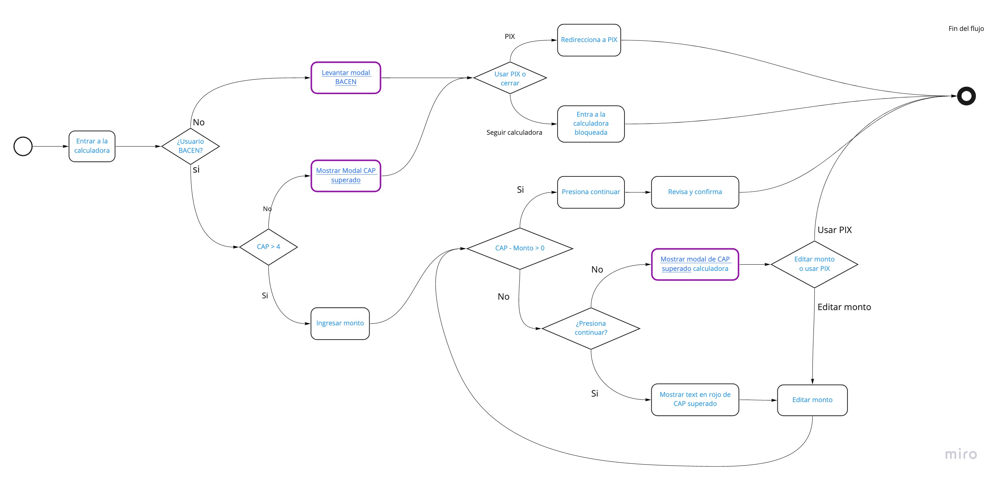

## Modelo de respuestas para iniciativa cashin MLB Boleto y Pec con soporte para BACEN
_______________

Este repo contiene las posibles respuestas y wordings correspondientes a los casos vistos 
para usuarios BACEN y no BACEN que tengan o no disponibilidad de CAP.

Se mapean los siguientes casos:
* Usuario sin BACEN.
* Usuario con CAP superado.
* Happy path:
    * Usuario con todo el CAP mensual disponible.
    * Usuario con CAP disponible parcialmente.
    * Usuario con CAP disponible parcialmente y con solo dos depósitos disponibles.

### Diagrama BPMN del flujo:
______________

