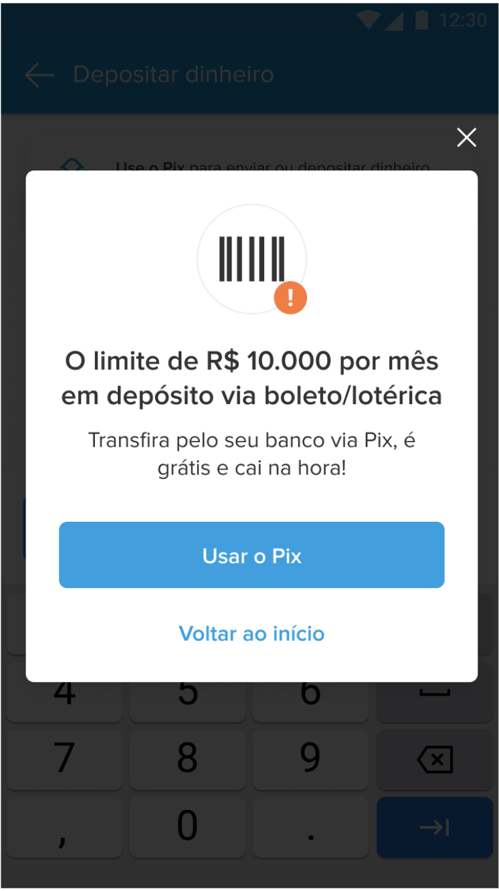

## CAP Exceeded
___________
Este caso de respuesta ocurre cuando el usuario ha superado el CAP mensual disponible (10.000 Reales).

Escenario: Al abrir la calculadora se debe levantar un modal que no permita avanzar al usuario.
Debe darle dos opciones: 
* Ir a pix
* Volver al hub de money-in

### Ejemplo
____________

