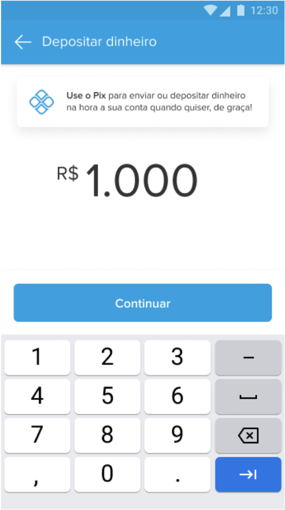
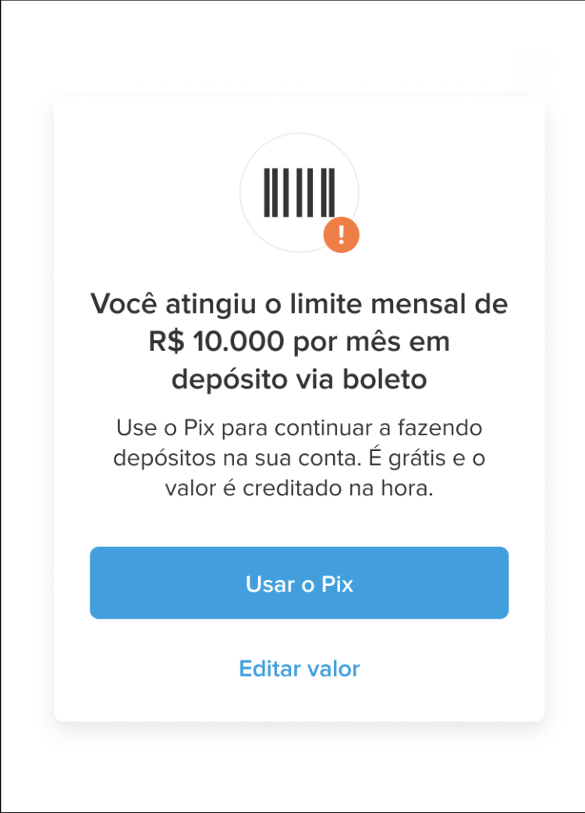
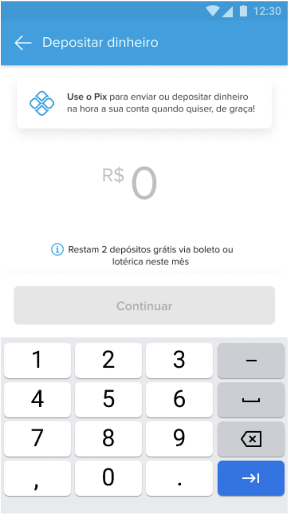

## Happy path 
Los casos happy path son aquellos donde el usuario cumple con BACEN y tiene CAP disponible para depositar.
______________
### Escenario 1: El usuario tiene disponible todo su CAP mensual (full-cap-response.json)
En este caso el usuario puede depositar la totalidad del máximo disponible dependiendo del método de pago. Si es Boleto puede depositar R$ 10.000, si es Pec $2.000.
______________

### Escenario 2. El usuario tiene disponible parcialmente su CAP mensual (partial-cap-response.json)
En este caso el usuario puede depositar cómo máximo su CAP disponible. Dependiendo del método de pago, este puede ser > R$ 10.000 si es Boleto o >= $2.000 si es Pec.
______________

Si el usuario ingresa un monto superior al CAP disponible, se lo mostrará un mensaje de error en la calculadora indicando que está superando su CAP disponible. En caso de dar a continuar se levantará un modal de error.
______________

### Escenario 3: El usuario tiene disponible 2 retiros gratis más en el mes (two-remaining-deposits-response.json)
En este caso no se considerará las variables de CAP, solo se le mostrará al usuario un mensaje informándole que le quedan dos depósitos disponibles en el mes. 
_____________

