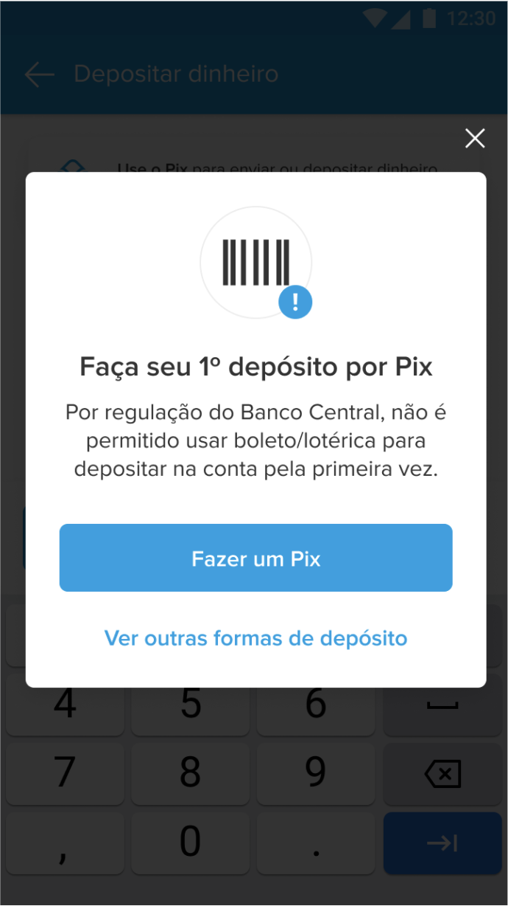

## User not bacen
___________
Este caso de respuesta ocurre cuando el usuario no ha realizado movimientos en su cuenta o es nuevo.

Escenario: Al abrir la calculadora se debe levantar un modal que no permita avanzar al usuario.
Debe darle dos opciones: 
* Ir a pix
* Volver al hub de money-in

### Ejemplo
____________

